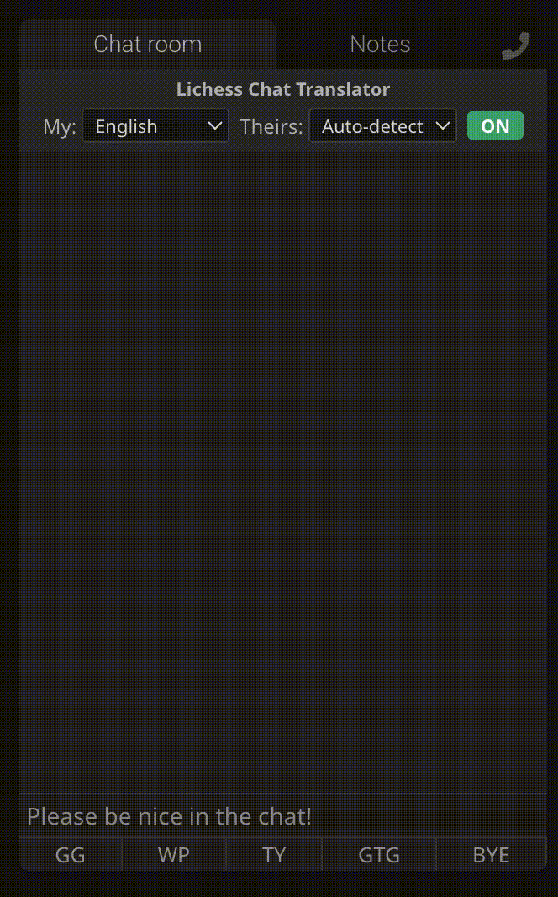

# Lichess Chat Translator

A Chrome extension that translates incoming and outgoing chat messages during Lichess games using Chrome's built-in [Translator](https://developer.chrome.com/docs/ai/translator-api) and [Language Detection](https://developer.chrome.com/docs/ai/language-detection) APIs.

## Requirements

- Chrome 138+

## Install

1. Go to `chrome://extensions`
2. Enable **Developer mode** (top right)
3. Click **Load unpacked** and select this folder

## Usage

Open any Lichess game with chat. A translator control panel appears above the chat with:

- **My** — your language (default: English). Incoming messages are translated into this.
- **Theirs** — opponent's language (default: Auto-detect). Your outgoing messages are translated into this. Auto-detection locks in the detected language once an opponent message arrives.
- **ON/OFF** toggle — disable translation without removing the extension.

Incoming messages show the translation in parentheses after the original. Outgoing messages show your original text in parentheses after the translated version.

## Files

| File | Purpose |
|------|---------|
| `manifest.json` | Extension manifest (MV3) |
| `content.js` | Translation logic, DOM injection, chat observation |
| `styles.css` | Styling for language selector controls |

## How it works

- A `MutationObserver` watches the chat for new messages
- Incoming opponent messages are auto-detected for language and translated inline
- Outgoing messages are intercepted on Enter keypress, translated, then sent — with the original shown in parentheses
- Opponent language auto-detects from their first message and locks into the dropdown
- Translator instances are cached and cleared when language selections change
